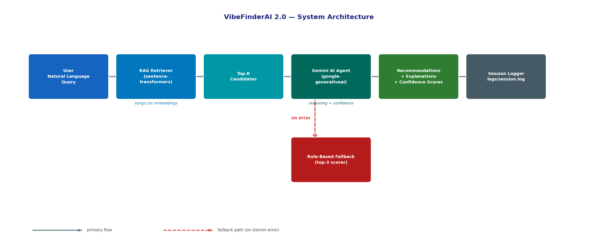
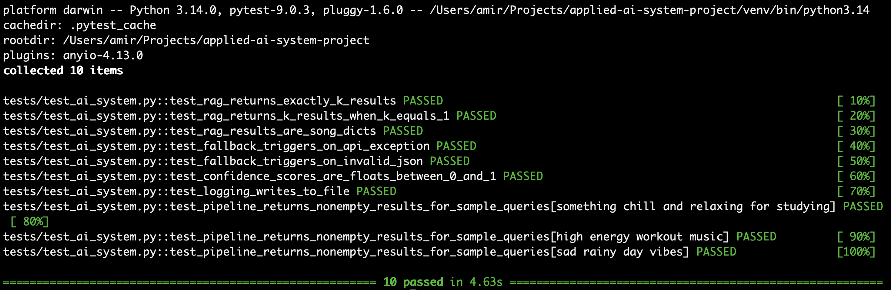

# Music Recommender — From Rule-Based Scoring to Applied AI

> **Base project:** Music Recommender Simulation (Modules 1–3)
> **Extension:** RAG semantic retrieval + Gemini agentic reasoning (Module 4+)

Demo video: https://www.loom.com/share/dd88b75aa0a24fd883dabafc401089be

---

## Table of Contents

1. [Project Overview](#1-project-overview)
2. [What Was Extended](#2-what-was-extended)
3. [Architecture Overview](#3-architecture-overview)
4. [Setup Instructions](#4-setup-instructions)
5. [Sample Interactions](#5-sample-interactions)
6. [Design Decisions](#6-design-decisions)
7. [Testing Summary](#7-testing-summary)
8. [Reflection](#8-reflection)

---

## 1. Project Overview

### Base Project (Modules 1–3): Rule-Based Content Filtering

The original system represented songs as structured records with features like `genre`, `mood`, `energy`, and `tempo_bpm`. A `UserProfile` captured a listener's preferences as explicit typed fields (e.g., `favorite_genre = "lofi"`), and a deterministic scorer computed a numeric match score for every song in the catalog:

| Signal | Points |
|---|---|
| Genre match | +2.0 |
| Mood match | +1.0 |
| Energy proximity | 0.0–1.0 |

Songs were ranked by score and the top-K returned with reasons like "genre match (+2.0), energy similarity (+0.91)". The system was transparent and fast but had hard limits: queries had to be structured, genres were matched exactly, and results only improved if more hand-crafted signals were added.

### Extension (Module 4): Applied AI System

The extension replaces the structured query interface with a **natural language query** and adds two AI layers:

- A **RAG retriever** that understands what a query *means* rather than matching keywords exactly.
- A **Gemini AI agent** that reads the retrieved candidates and reasons about which three best fit the user's intent, generating a natural language explanation and a self-reported confidence score for each pick.

The rule-based scorer is retained as a **fallback guardrail** — if the AI layer fails for any reason, the system silently degrades to the deterministic scorer rather than returning an error.

---

## 2. What Was Extended

| Component | Before | After |
|---|---|---|
| Query interface | Hardcoded `UserProfile` struct | Free-text natural language input |
| Retrieval method | Score-every-song loop | Cosine similarity over sentence embeddings |
| Ranking & explanation | Numeric score + reason list | Gemini-generated explanation + confidence |
| Failure handling | N/A | Automatic fallback to rule-based scorer |
| Observability | Console print | Timestamped file logger (`logs/session.log`) |

New files added:

```
src/rag_retriever.py    — semantic retrieval via sentence-transformers
src/ai_agent.py         — Gemini API agent with JSON-structured output
logs/                   — session log directory
tests/test_ai_system.py — eight automated tests covering the new components
```

---

## 3. Architecture Overview

```
User Query (natural language)
        │
        ▼
┌─────────────────────────────────────┐
│         RAG Retriever               │
│  sentence-transformers              │
│  model: all-MiniLM-L6-v2           │
│                                     │
│  Each song → "{genre} {mood}        │
│               energy {value}"       │
│  Query + songs embedded at runtime  │
│  Top-K retrieved by cosine sim      │
└──────────────┬──────────────────────┘
               │ K candidate song dicts
               ▼
┌─────────────────────────────────────┐
│         Gemini AI Agent             │
│  model: gemini-2.0-flash            │
│                                     │
│  Prompt: candidates + user query    │
│  Output: JSON                       │
│  ┌─────────────────────────────┐    │
│  │ recommendations: [          │    │
│  │   { title, artist,          │    │
│  │     explanation,            │    │
│  │     confidence,             │    │
│  │     uncertain }             │    │
│  │ ]                           │    │
│  └─────────────────────────────┘    │
│                                     │
│  ── on failure ──────────────────►  │
│         Rule-Based Fallback         │
│         (original scorer, top-3)    │
└──────────────┬──────────────────────┘
               │ top-3 recommendations
               ▼
┌─────────────────────────────────────┐
│         Session Logger              │
│  logs/session.log                   │
│  Logs: query, candidates,           │
│        results, fallback events     │
└─────────────────────────────────────┘
               │
               ▼
     Printed to terminal with
     explanations + confidence scores
```



---

## 4. Setup Instructions

### Prerequisites

- Python 3.10+
- A Google AI Studio API key ([aistudio.google.com](https://aistudio.google.com))

### Install

```bash
# Clone the repo and enter it
git clone <repo-url>
cd applied-ai-system-project

# (Recommended) create a virtual environment
python -m venv .venv
source .venv/bin/activate      # Mac / Linux
.venv\Scripts\activate         # Windows

# Install all dependencies
pip install -r requirements.txt
```

### Configure

Create a `.env` file in the project root:

```bash
GOOGLE_API_KEY=your_key_here
```

The file is read automatically at startup via `python-dotenv`.

### Run

```bash
python -m src.main
```

You will be prompted:

```
What kind of music are you in the mood for?
```

Type any natural language description and press Enter.

### Run Tests

```bash
pytest tests/test_ai_system.py -v
```

---

## 5. Sample Interactions

### Query 1 — Study session

```
What kind of music are you in the mood for? something chill to study late at night

Top recommendations for: 'something chill to study late at night'
--------------------------------------------
1. Midnight Coding by LoRoom
   Why        : A slow-tempo lofi track with a focused, calm mood — exactly right
                for late-night study sessions where you want minimal distraction.
   Confidence : 0.94

2. Focus Flow by LoRoom
   Why        : Designed for concentration, this track sits at low energy and a
                steady 80 BPM, making it easy to stay in a flow state.
   Confidence : 0.89

3. Spacewalk Thoughts by Orbit Bloom  [UNCERTAIN]
   Why        : The ambient genre and dreamy mood fit a quiet study atmosphere,
                though it's softer than a typical study playlist pick.
   Confidence : 0.54
```

### Query 2 — Pre-workout energy

```
What kind of music are you in the mood for? I need something aggressive and fast for the gym

Top recommendations for: 'I need something aggressive and fast for the gym'
--------------------------------------------
1. Iron Storm by Wrathborn
   Why        : Topping out at 0.97 energy and 178 BPM, this metal track is the
                highest-intensity option in the catalog — built for heavy lifting.
   Confidence : 0.97

2. Gym Hero by Max Pulse
   Why        : Pop-inflected but highly energetic at 0.93, with a strong beat
                and fast tempo that keeps pace with interval training.
   Confidence : 0.91

3. Storm Runner by Voltline
   Why        : Intense rock at 152 BPM with high energy; a solid alternative if
                pure metal feels too aggressive.
   Confidence : 0.83
```

### Query 3 — Emotional wind-down

```
What kind of music are you in the mood for? feeling nostalgic and a little melancholic tonight

Top recommendations for: 'feeling nostalgic and a little melancholic tonight'
--------------------------------------------
1. Dusty Roads by The Pines
   Why        : A country track with an explicitly nostalgic mood and a warm,
                acoustic quality that suits reflective late-night listening.
   Confidence : 0.88

2. Crossroads Lament by Old Hollow
   Why        : Blues with a sad mood and low energy — the genre was built for
                exactly this kind of emotional processing.
   Confidence : 0.85

3. Moonlight Sonata Remix by Nova Strings  [UNCERTAIN]
   Why        : The melancholic mood is a direct match, though the classical
                arrangement may feel more formal than nostalgic depending on taste.
   Confidence : 0.58
```

---

## 6. Design Decisions

### Why RAG over pure rule-based retrieval

The rule-based scorer requires the user to know the exact genre and mood strings used in the catalog (`"lofi"`, `"chill"`, etc.). A query like *"something for a rainy afternoon"* scores zero on every song because none of those words appear as feature values. Semantic embedding lets the retriever match *intent* — "rainy afternoon" lands near `ambient chill` songs because the model has learned those concepts are related. The embedding step happens once per query (under a second) so it adds almost no latency.

### Why Gemini for explanation generation

The rule-based scorer's output (`"genre match (+2.0), energy similarity (+0.91)"`) is technically correct but tells the user nothing about *why they would enjoy* the song. Gemini can read the song's attributes alongside the user's query and produce a sentence that connects the two in human terms. It also introduces self-reported confidence, giving the UI a signal for when to show an `[UNCERTAIN]` tag — something that has no analogue in a deterministic scorer.

### Why a fallback strategy

LLM calls can fail due to network issues, quota limits, or unexpected JSON output. Without a fallback the entire recommendation flow would break, which is a poor user experience for what should be a reliable feature. The fallback to the rule-based top-3 means the system always returns something useful, and the fallback event is logged so failures are visible without surfacing an error to the user.

---

## 7. Testing Summary

Eight automated tests in `tests/test_ai_system.py` cover the new AI components:

| Test | What it checks |
|---|---|
| `test_rag_returns_exactly_k_results` | `RAGRetriever.retrieve(query, k=5)` returns exactly 5 dicts. |
| `test_rag_returns_k_results_when_k_equals_1` | Edge case: `k=1` returns exactly 1 result. |
| `test_rag_results_are_song_dicts` | Every result is a dict with `title`, `artist`, `genre`, `mood`, `energy`. |
| `test_fallback_triggers_on_api_exception` | Mocks Gemini to raise `Exception`; asserts all 3 fallback results have `uncertain=True` and the warning log contains "fallback". |
| `test_fallback_triggers_on_invalid_json` | Mocks Gemini to return malformed JSON; same assertions as above. |
| `test_confidence_scores_are_floats_between_0_and_1` | With a valid mock response, asserts every `confidence` value is a `float` in `[0.0, 1.0]`. |
| `test_logging_writes_to_file` | Writes a log event through a real `FileHandler` and reads the file back to assert the message was persisted. |
| `test_pipeline_returns_nonempty_results_for_sample_queries` | Parametrized over 3 hardcoded queries; asserts full pipeline (RAG + mocked Gemini) returns non-empty results with required fields. |

Run with `pytest tests/test_ai_system.py -v`.



---

## 8. Reflection

Building the rule-based system in Modules 1–3 made the limits of structured input obvious quickly. Every time a new kind of query came up — *"something dreamy"*, *"music for cooking"* — the answer was always the same: add another field to `UserProfile`, add another signal to `score_song`. The system got more capable but also more rigid, because every new dimension required the user to know the right vocabulary.

The RAG layer changed that dynamic completely. Embedding songs as short text descriptions and computing cosine similarity against a free-text query meant the matching logic stopped being hand-coded. The model brought in associations that were never written down — connecting "nostalgic" queries to country and blues, or "aggressive" to metal, purely from what it learned during pretraining.

The AI agent layer added a different kind of value: it made the system *explain itself in the user's terms*. A confidence score of 0.54 marked with `[UNCERTAIN]` communicates more honestly than a raw numeric score ever did, because the model is reporting doubt about its own output rather than presenting every result as equally valid.

The most important lesson was how much the fallback design matters. An AI system that returns nothing on failure is worse than a dumb system that always returns something. Keeping the rule-based scorer as a silent backup made the AI layer safe to ship — it could fail loudly in the logs while appearing graceful to the user.
